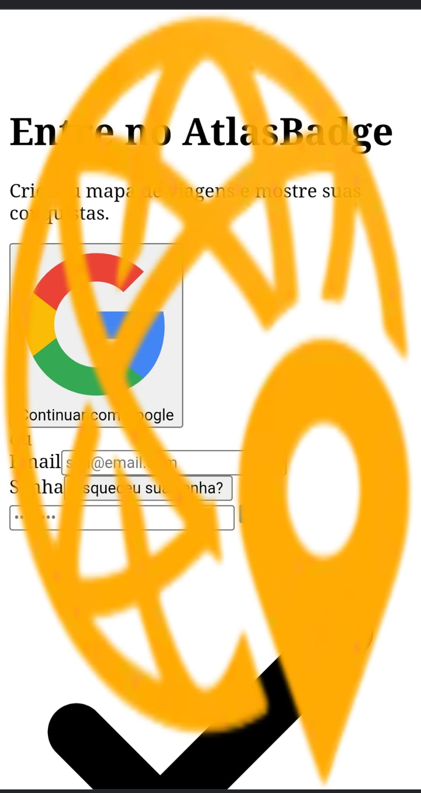

# AB-DEF-003 — Production CSS not applied in the affected Android browser

## Defect summary

| Field | Value |
|---|---|
| Defect ID | AB-DEF-003 |
| Evidence ID | AB-EV-018 |
| Related risks | QR-39; QR-40 |
| Environment | Vercel Production; Google Chrome on Android |
| Severity | High |
| Status | Closed after correction and same-device Production retest |
| Final Production commit | `eca539ea793a2aadc4be657f0b9dd549f1f04699` |

## Expected result

Home, Login, the map and Footer should load the approved responsive styles, typography, spacing and bounded SVG assets in Chrome on Android.

## Observed result

The affected Android browser rendered a largely unstyled interface:

- default serif text;
- browser-default inputs and links;
- oversized logo and provider/social SVGs;
- overlapping text and map content;
- unusable mobile layout.

## Selected sanitised evidence

<p>
  
  
  
</p>

The browser chrome, status bar and unnecessary device details were cropped from the public copies. The original screenshots remain private.

## Investigation and root cause

The local production-build comparison showed that the affected build retained untransformed CSS cascade layers. The corrected PostCSS pipeline removes the residual layer dependency for the affected browser environment.

The root-cause conclusion was accepted only after:

1. before/after production CSS comparison;
2. local `npm run build` and `npm start` validation;
3. fresh-cache and reused-cache Android-context tests;
4. controlled Vercel deployment;
5. retest in the same physical Android environment.

## Correction

| Commit | Change |
|---|---|
| `4fdf260e8ca49f346b2366a5e4936c5d8a95f7ef` | Restored the production PostCSS cascade-layer transformation. |
| `eca539ea793a2aadc4be657f0b9dd549f1f04699` | Added permanent CSS and responsive regression coverage and became the final deployed release. |

## Retest

The Test Lead confirmed after Production deployment that:

- AtlasBadge styles loaded;
- logo and icons returned to expected dimensions;
- Home, Login, Footer and map were usable;
- portrait and landscape layouts were restored;
- no HTML-like unstyled fallback remained.

## Regression control

Permanent checks validate:

- stylesheet status and MIME;
- computed typography and layout;
- logo, provider icon and social-icon bounds;
- map containment;
- Android fresh and reused cache contexts;
- desktop preservation.

## Final decision

```text
AB-DEF-003 closed
QR-39 retained as Regression risk
```
