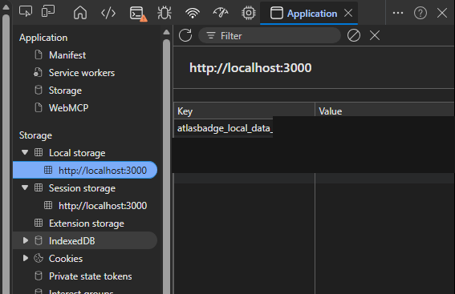
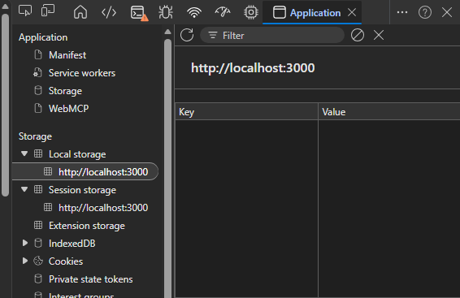

# QR-03 — Private cache remains after explicit logout

**Evidence ID:** AB-EV-003  
**Evidence status:** Public narrative and sanitised screenshots complete  
**Related quality risk:** QR-03  
**Classification:** Product defect and privacy-control failure  
**Formal operational defect ID:** Not supplied for this public record  
**Severity and priority:** Not restated because the verified classifications were not supplied  
**Correction commit:** `d8179cb`  
**Target release:** AtlasBadge V1.0  

## 1. Evidence purpose

This record documents the private-cache risk identified after explicit logout, the correction strategy, automated coverage, local validation and Production smoke decision.

It intentionally avoids publishing UIDs, private cache values, authentication payloads, e-mail addresses, usernames or travel data.

## 2. Previous behaviour

Before the correction, private user data cached by AtlasBadge remained in `localStorage` after an explicit logout.

The user session ended, but private cache categories could still be present in browser storage.

## 3. Expected behaviour

After explicit logout:

- private account-specific cache must be removed;
- data from the previous account must not remain available to the next browser user;
- non-sensitive preferences may remain when they do not identify or expose private user state;
- the application must not depend on broad destructive clearing that removes unrelated storage.

## 4. Privacy and release impact

The behaviour created a risk on shared browsers or computers.

Isolation by UID reduced accidental cross-account use inside the application, but it did not replace the need to remove private local data after explicit logout. A person with access to the same browser storage could still encounter residual private material.

The issue therefore affected privacy confidence and V1.0 logout acceptance.

## 5. Root cause

The authentication logout flow did not centrally remove all AtlasBadge private-cache categories.

Private storage lifecycle was distributed rather than enforced through one explicit cleanup strategy linked to logout.

## 6. Correction strategy

The correction introduced central private-cache cleanup by category.

The strategy:

- removes AtlasBadge private user cache during explicit logout;
- preserves approved non-sensitive preferences;
- avoids `localStorage.clear()`;
- does not indiscriminately remove unrelated application or browser storage;
- preserves the separate account-deletion flow and its required cleanup behaviour.

## 7. Automated coverage

The reusable script `scripts/testQR03.ts` was added to protect the corrected behaviour.

The intended coverage includes:

- creation or detection of private cache before logout;
- explicit logout;
- removal of private cache categories;
- preservation of approved non-sensitive preferences;
- continued absence of private cache after refresh;
- account-switch isolation.

The exact raw script output is not included in this public record.

## 8. Pipeline

The correction progressed through the project pipeline before Production approval.

Exact individual gate results were not supplied for this evidence package and are therefore not invented. A sanitised verified pipeline summary may be attached later.

## 9. Local QA

Local QA was performed in an InPrivate browser window and covered:

1. login with a disposable test account;
2. generation or confirmation of a private cache key;
3. verification that the private key existed before explicit logout;
4. explicit logout;
5. verification that private cache categories were absent;
6. refresh with `F5`;
7. confirmation that the removed private cache did not reappear;
8. login or switch to another disposable account;
9. confirmation that the previous account's private cache was not reused.

The Test Lead approved the local behaviour.

## 10. Production smoke

Production smoke covered the corrected logout journey and the absence of the relevant private cache after logout.

The Test Lead approved the Production result.

## 11. Test Lead decision

The correction was approved for AtlasBadge V1.0 after:

- implementation review;
- automated coverage through `scripts/testQR03.ts`;
- InPrivate local QA;
- login, logout, refresh and account-switch checks;
- Production smoke.

QR-03 remains a permanent regression area. Its Quality Risk status is intentionally not updated by this evidence task.

## 12. Residual risks and limitations

- Private-cache categories must remain centrally governed as new cached data is introduced.
- The record covers explicit logout and the tested refresh/account-switch paths.
- It does not claim exhaustive proof for every abnormal browser termination or every third-party storage mechanism.
- Exact pipeline gate output remains pending for the public package.
- Public screenshots are available in this evidence directory.

## 13. Sanitised public screenshots

### AB-EV-003-A — Private key present before logout

### AB-EV-003-B — Private keys absent after logout

## 14. Evidence still private or pending sanitisation

- original before-and-after screenshots;
- raw `localStorage` values;
- Firebase Authentication storage;
- real or identifiable account information;
- raw console output;
- complete pipeline logs;
- raw AI-assisted implementation reports.
