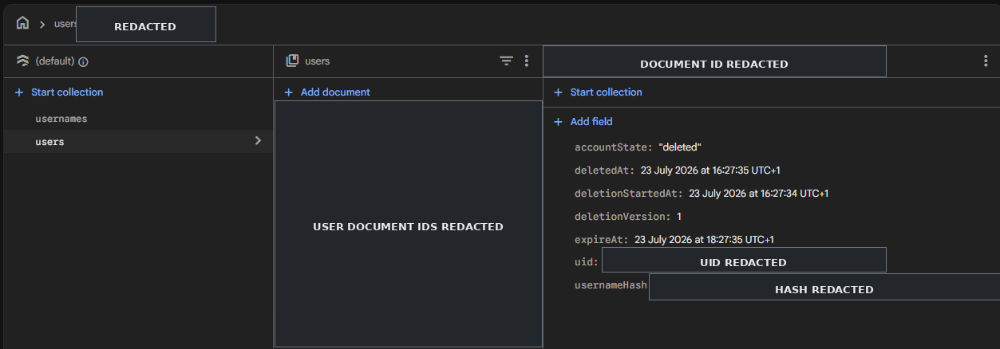
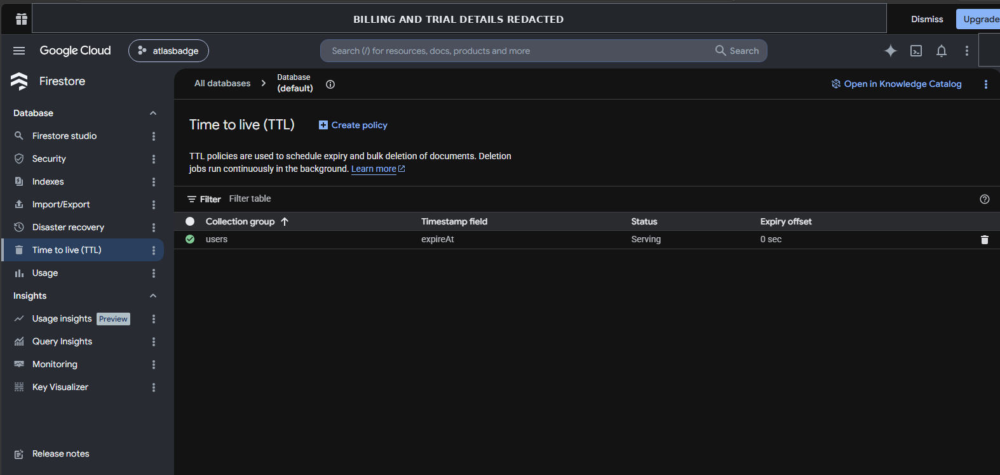

# QR-07 — Retry-Safe Account Deletion

## Evidence metadata

| Item | Value |
|---|---|
| Product | AtlasBadge |
| Quality risk | QR-07 — Partial account deletion |
| Risk priority | High |
| Environment | Production |
| Validation date | 23 July 2026 |
| Product commit | `7150cb2141a86bff659cf417ac1ba5f4e9dd1385` |
| Commit message | `fix(account): make account deletion retry-safe` |
| Final status | Closed — Approved in Production by Test Lead |

## Risk statement

Account deletion could partially fail across Firebase Authentication, Cloud Firestore and Firebase Storage, leaving account records, username mappings, public-profile data, travel data or stored objects in an inconsistent state.

These services do not provide one distributed transaction, so the deletion flow must stop safely at each failure point and support a controlled retry.

## Confirmed defect

The username-cleanup step previously treated query or batch-deletion errors as non-blocking. The flow could continue to the tombstone and Firebase Authentication deletion stages while one or more username mappings remained reserved.

This could produce a false success response and leave an orphaned username mapping until a later manual correction.

## Corrective action

The account-deletion workflow was updated so that:

- username query and batch-cleanup failures are blocking;
- the final tombstone is not written after a username-cleanup failure;
- the Firebase Authentication user is not deleted after a username-cleanup failure;
- missing resources are treated idempotently when their absence is compatible with a prior partial deletion;
- retry can resume from the `deleting` or `deleted` state;
- the tombstone retains only the technical fields required for safe retry and expiry;
- server errors returned to the client remain stable and do not expose personal data or internal Firebase details;
- dependency injection supports real fault-injection tests without changing Production defaults.

## Verification summary

### Local and emulator verification

| Verification | Result |
|---|---|
| Account-deletion automated suite | 82 passed |
| Firestore Rules regression | 92 passed |
| Production build | Passed |
| New QR-07 lint defects | None identified |
| Storage failure and retry coverage | Passed |
| Partial Firestore batch failure and retry coverage | Passed |
| Username query and batch failure coverage | Passed |
| Tombstone-write failure and retry coverage | Passed |
| Firebase Authentication deletion failure and retry coverage | Passed |

The emulator suite was used to validate failure injection, blocking behaviour, retry and idempotency. It was not treated as a replacement for the final Production integration test.

### Production validation

A disposable account with sanitised test data was created and deleted through the real user interface.

| Production check | Result |
|---|---|
| Reauthentication completed | Passed |
| Deletion endpoint completed successfully | Passed |
| Firebase Authentication user removed | Passed |
| Private Firestore data removed | Passed |
| Travel places and memories removed | Passed |
| Firebase Storage objects removed | Passed |
| Public profile no longer resolved | Passed |
| Username released for reuse | Passed |
| Local private cache and session removed | Passed |
| Sanitised tombstone created | Passed |
| TTL policy for `users.expireAt` | Confirmed — `Serving` |

## Evidence

### Sanitised deletion tombstone

The deleted account document contains only technical deletion metadata. User document identifiers, the UID and the username hash have been redacted from the public evidence.

### Firestore TTL policy

The Production Firestore database has an active TTL policy for the `users` collection group using the `expireAt` timestamp field. The policy status was `Serving` with an expiry offset of `0 sec`.

Billing information and the account avatar have been redacted from the public evidence.

## Residual limitations

- Firebase Authentication, Cloud Firestore and Firebase Storage do not form one global transaction.
- A later-stage failure may occur after an earlier resource has already been removed.
- Retry remains necessary for convergence after a recoverable infrastructure failure.
- Token revocation does not necessarily cancel operations already in flight.
- Firestore TTL deletion is asynchronous and is not expected to occur exactly at the `expireAt` timestamp.

## Test Lead decision

The confirmed defect was corrected, the affected failure paths were covered locally with emulators, and the complete account-deletion happy path was validated with a disposable account in Production.

**Decision:** `QR-07 closed — Approved in Production by Test Lead`
