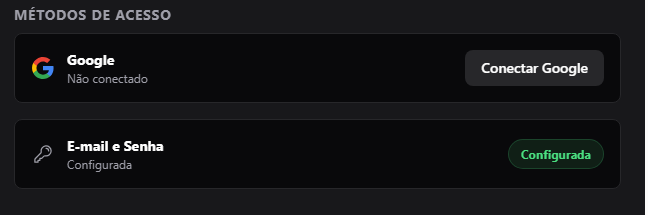
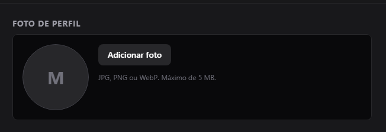
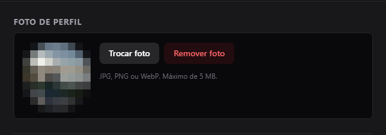
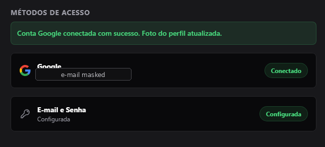

# QR-10 — Wrong identity during access-method linking

**Evidence ID:** AB-EV-007  
**Related quality risk:** QR-10  
**Product:** AtlasBadge V1.0  
**Environment:** Firebase Auth/Firestore Emulators, Microsoft Edge, Vercel Production  
**Production validation date:** 2026-07-29  
**Final status:** Passed — Mitigated  
**Decision owner:** Test Lead/Product Owner  

## 1. Executive summary

QR-10 covered the risk that a Google access method could be linked to the wrong AtlasBadge identity when e-mail matching, concurrent requests, popup cancellation, provider conflicts or rollback behaviour failed.

The correction was validated at component, Firestore integration, browser E2E and Production levels. The final Production smoke confirmed that:

- the existing E-mail and Password method remained configured;
- Google was linked to the existing AtlasBadge account;
- the profile photo was imported only when the AtlasBadge profile had no existing avatar;
- profile information remained intact;
- refresh and linked-provider login returned to the same AtlasBadge profile;
- the Test Lead approved the behaviour for AtlasBadge V1.0.

## 2. Risk statement

> An access method may be linked to the wrong identity if e-mail matching, reauthentication, cancellation or rollback behaviour fails.

A failure in this area could make a valid profile appear lost, expose the wrong account, create a duplicate profile, copy identity data to another user, or leave a partially linked authentication state.

## 3. Confirmed implementation gaps

The investigation identified three material control gaps in the original linking flow:

| Gap | Risk |
|---|---|
| Rollback could fail or remain unconfirmed without sufficiently explicit user feedback | The UI could imply that no Google provider remained linked when the final provider state was uncertain |
| Concurrent clicks could start overlapping linking requests | Multiple popup/linking operations could race and create inconsistent state |
| Popup-blocked handling was generic | The user did not receive actionable recovery guidance |

A related profile-photo gap was also confirmed: an account created with E-mail and Password did not import the Google provider photo after successful linking, even when the AtlasBadge profile had no avatar.

## 4. Correction summary

The functional correction introduced:

- an explicit rollback result contract: `confirmed`, `failed` or `unconfirmed`;
- synchronous in-flight protection using a ref-based mutex;
- actionable popup-blocked feedback;
- e-mail and UID validation before accepting the linked provider;
- safe reconciliation after linking or rollback;
- Firestore as the authoritative avatar source;
- a Firestore transaction that imports the Google photo only when `avatarUrl` is absent;
- preservation of an existing custom avatar;
- secondary Firebase Authentication profile synchronisation;
- no artificial profile, username, place or visit records.

## 5. Traceability

| Control objective | Verification |
|---|---|
| Preserve the existing AtlasBadge identity | Component tests, Auth Emulator E2E, Production smoke |
| Keep E-mail and Password configured | Auth Emulator E2E and Production evidence |
| Reject or roll back a provider with a different e-mail | Component tests and WEB-I03 |
| Prevent concurrent linking operations | Component tests and E2E retry/cancellation coverage |
| Handle `credential-already-in-use` without switching account | WEB-I04 |
| Release loading state after popup cancellation | WEB-I05 |
| Preserve provider and profile state after refresh | WEB-I06 |
| Return to the same profile after Google logout/login | WEB-I07 |
| Import Google photo when no avatar exists | Component tests, Firestore integration, WEB-I01 and Production smoke |
| Preserve an existing custom avatar | Component tests, Firestore integration and WEB-I02 |
| Prevent unauthorised avatar writes | Firestore Rules integration |
| Avoid Production access during automation | Demo-project network isolation assertions |

## 6. Automated verification

### 6.1 Component and behaviour tests

- QR-10 suite: **18 passed**
- Google profile-photo suite: **10 passed**
- Vitest total: **28 passed**
- Expected failures: **0**
- Unhandled asynchronous errors: **0**

### 6.2 Firestore integration

The Firestore Emulator validated the intended avatar transaction and current Rules:

- import when `avatarUrl` is absent;
- preserve an existing avatar;
- protect against concurrent custom-avatar updates;
- reject an authenticated user writing another user's profile;
- preserve unrelated profile fields.

Invalid or non-HTTPS photo URLs were rejected client-side before a database write was attempted.

### 6.3 Auth Emulator browser E2E

Playwright controlled Microsoft Edge against Authentication, Firestore and Storage Emulators using a `demo-` Firebase project.

| Scenario | Result |
|---|---|
| WEB-CAP-01 — Local Google provider popup capability | Passed |
| WEB-I01 — Positive linking and photo import | Passed |
| WEB-I02 — Existing custom avatar preserved | Passed |
| WEB-I03 — Different e-mail rollback | Passed |
| WEB-I04 — Credential already in use | Passed |
| WEB-I05 — Popup cancellation and retry | Passed |
| WEB-I06 — Refresh persistence | Passed |
| WEB-I07 — Logout/login through linked Google provider | Passed |

Consolidated result: **8 passed, 0 failed**. External Firebase requests detected during the demo E2E execution: **0**.

## 7. Production deployment

The following AtlasBadge commits were published to `main`:

| Commit | Purpose |
|---|---|
| `b3841e4` | Harden Google linking and synchronise the profile photo |
| `004f8ee` | Add Firestore avatar integration coverage |
| `a52af4f` | Add Authentication Emulator browser E2E coverage |

The Test Lead confirmed the Vercel Production deployment for commit `a52af4f`.

No deployment was required for:

- Firestore Rules;
- Storage Rules;
- Cloud Functions;
- Firestore indexes;
- Firebase Authentication configuration.

## 8. Production smoke result

The Production evidence directly shows:

- Google initially not connected;
- E-mail and Password configured before linking;
- no custom avatar before linking;
- Google connected successfully;
- E-mail and Password still configured after linking;
- success feedback confirming the photo update;
- a profile image present after linking.

The Test Lead additionally confirmed that refresh, logout/login through the linked Google provider and the wider profile flow worked correctly in Production.

| Production control | Result |
|---|---|
| Positive Google linking | Passed |
| Existing E-mail and Password method preserved | Passed |
| Same AtlasBadge account/profile preserved | Passed |
| Google photo imported when avatar was absent | Passed |
| Profile data preserved | Passed |
| Refresh persistence | Passed — Test Lead confirmation |
| Logout/login persistence | Passed — Test Lead confirmation |
| Production deployment | Passed |

## 9. Sanitised public evidence

### QR-10-01 — Access methods before linking

Google is not connected before the test. E-mail and Password is already configured.

### QR-10-02 — Profile before Google photo import

The AtlasBadge profile has no custom avatar before linking.

### QR-10-03 — Profile after Google photo import

A profile image is present after successful linking. The personal image has been pixelated in the public copy.

### QR-10-04 — Linked access method and success feedback

The Google method is connected, E-mail and Password remains configured, and the UI confirms that the profile photo was updated. The real e-mail address has been masked.

## 10. Test Lead decision

**Passed — Mitigated**

QR-10 is approved for AtlasBadge V1.0. The unsafe linking paths were corrected, reusable automated coverage was added, deployment parity was confirmed, and the Production smoke was approved.

The item remains part of regression coverage because identity linking is a high-impact account-integrity flow.

## 11. Residual risk and regression expectation

Residual risk remains for provider or browser changes outside the tested combinations, third-party OAuth behaviour changes, and future modifications to Firebase Authentication or profile synchronisation.

Permanent regression coverage should retain:

- same-identity linking;
- different e-mail rollback;
- provider already in use;
- popup blocked or cancelled;
- concurrent user actions;
- refresh;
- linked-provider logout/login;
- photo import;
- existing-avatar preservation;
- Firestore authorisation and profile-field integrity.

## 12. Publication control

The public screenshots were cropped and sanitised. The Google e-mail was masked, the profile image was pixelated, unrelated personal profile fields were removed, and no UID, token, cookie, OAuth URL, private payload or environment value is included.

Raw screenshots and AI-assisted investigation logs remain private.
