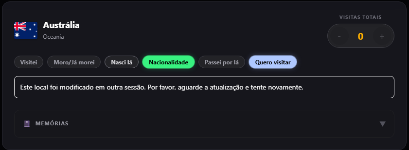

# AB-DEF-004 — Rapid same-session status changes triggered a false external conflict

## Defect summary

| Field | Value |
|---|---|
| Defect ID | AB-DEF-004 |
| Evidence ID | AB-EV-018 |
| Related risks | QR-04; QR-16; QR-17; QR-18; QR-19; QR-22 |
| Environment | Google Chrome on Android Production; Firebase Auth/Firestore Emulator regression |
| Severity | High |
| Status | Closed after correction and Production retest |
| Runtime correction | `9cdb1808e08213c61940b2308bb253c87eee98fd` |
| Final Production commit | `eca539ea793a2aadc4be657f0b9dd549f1f04699` |

## Expected result

Rapid status changes made in the same tab and session should be reconciled deterministically. The final local intent should persist without being misclassified as an independent external update.

A genuine stale write from another browser context must continue to trigger the approved optimistic-concurrency protection.

## Observed result

When the Test Lead changed statuses rapidly:

- the visible selection could disappear;
- an inappropriate rollback occurred;
- the application displayed a message stating that another session had modified the place.

No other session had changed the record.

## Selected sanitised evidence



The screenshot contains only the affected synthetic QA state and no personal account data.

## Root cause

Closely spaced local mutations could execute against stale mutation baselines. A pending mutation or subscription update could therefore make a later same-session intent appear stale and trigger the external-conflict path.

## Correction

The mutation orchestrator was changed from blindly chained mutation promises to a scoped task queue that:

- coalesces pending same-session work;
- re-evaluates the latest intent against fresh confirmed state;
- preserves deterministic final state;
- prevents an earlier rollback from deleting a later intent;
- retains true OCC protection for another browser context.

## Permanent validation

The dedicated Firebase Emulator E2E suite executed **11/11 Passed** scenarios covering:

- zero-delay and delayed rapid transitions;
- repeated toggling of the same status;
- writes pending during a later intent;
- snapshots between local intents;
- failed first writes;
- reload parity;
- visit duplication protection;
- counter and memory preservation;
- a genuine external conflict across two contexts.

Additional gates included:

- mutation-orchestrator unit tests: **8/8 Passed**;
- QR-04 context tests: **14/14 Passed**;
- complete Vitest suite: **150/150 Passed**;
- QR-24: **18/18 Passed**;
- Production build: **Passed**.

## Production retest

After deployment, the Test Lead repeated rapid status changes on the same Android device and confirmed:

- no false other-session message;
- the final status remained selected;
- synchronisation completed;
- no visit, counter or memory corruption occurred.

## Final decision

```text
AB-DEF-004 closed
QR-04 remains Regression risk with extended permanent coverage
```
