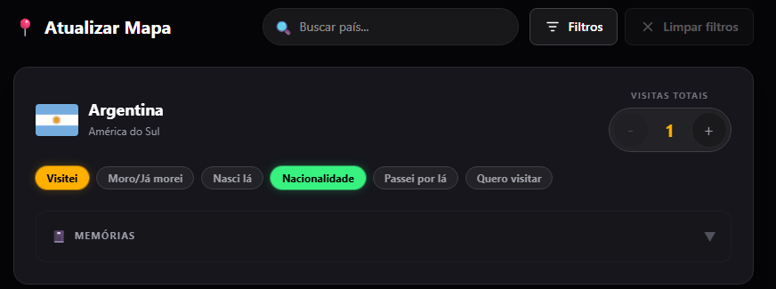

# AB-DEF-005 — Added status disappeared after optimistic synchronisation

## Defect summary

| Field | Value |
|---|---|
| Defect ID | AB-DEF-005 |
| Evidence ID | AB-EV-019 |
| Related risks | QR-01; QR-04; QR-16; QR-18; QR-19; QR-22 |
| Environment | Vercel Production; Firebase Auth/Firestore Emulators; Microsoft Edge and Chromium-based browser validation |
| Severity | High |
| Status | Closed after correction, automated regression and Test Lead Production retest |
| Runtime correction | `ff8d13ab923c988cf8f7d459681e9e251f34cf17` |
| Final approved Production baseline | `982091c` |

## Expected result

A permitted status selected for a country must remain active after optimistic rendering, Firestore persistence, subscription reconciliation and page reload.

The approved combination **Visited + Nationality** must remain valid. Adding **Nationality** must not change `visitsCount`, create or remove a `RegisteredVisit`, or alter memories.

## Observed result

With Argentina already marked **Visited** and `visitsCount = 1`:

1. the Test Lead selected **Nationality**;
2. **Nationality** became active immediately;
3. after synchronisation, **Nationality** disappeared;
4. **Visited** remained active;
5. the newly selected status was not retained in the final interface state.

## Selected sanitised evidence

<p>
  
</p>

<p>
  
</p>

The screenshots contain only the affected travel-state interface and no credentials, identifiers, notes or private account data.

## Root cause

The optimistic mutation path could reconcile a valid single status intent against stale confirmed state. Queue and subscription reconciliation could therefore replace the optimistic status object with an older snapshot even when the user action was permitted.

The defect was related to the real-time synchronisation and optimistic-concurrency path rather than to the status compatibility rule.

## Correction

The mutation orchestration and reconciliation path was corrected so that:

- a single valid intent is not discarded;
- same-session work is evaluated against current confirmed state;
- a successful write converges with the subscription snapshot;
- rollback occurs only for a genuine failure;
- true stale writes from another browser context remain protected by optimistic concurrency control.

## Permanent validation

Focused automated validation recorded:

- mutation-orchestrator tests: **7/7 Passed**;
- QR-04 context tests: **14/14 Passed**;
- TravelMapContext tests: **3/3 Passed**;
- status-persistence E2E: **2/2 Passed**;
- rapid-mutation E2E: **11/11 Passed**;
- TypeScript: **Passed**;
- lint: **Passed**;
- Next.js production build: **Passed**;
- `git diff --check`: **Passed**.

The permanent E2E coverage verifies:

- **Visited + Nationality** after a single click;
- Firestore persistence;
- subscription reconciliation;
- five-second stability;
- reload parity;
- counter integrity;
- `RegisteredVisit` integrity;
- memory preservation;
- rapid same-session mutations;
- genuine cross-context conflict protection.

## Production retest

The Test Lead confirmed in Production that:

- **Visited** remained active;
- **Nationality** remained active after synchronisation;
- both statuses remained active after reload;
- `visitsCount` remained correct;
- no false conflict message appeared;
- another country also retained the selected status;
- visits, counters and memories remained consistent.

## Final decision

```text
AB-DEF-005 closed
QR-04 remains Regression risk with permanent single-intent and rapid-mutation coverage
QR-01 remains Current gap only for broader persistence flows
```
