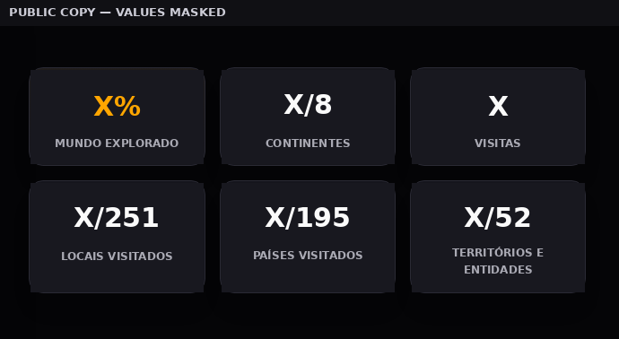
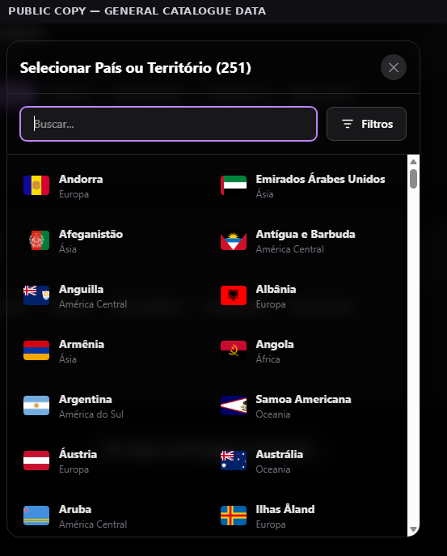
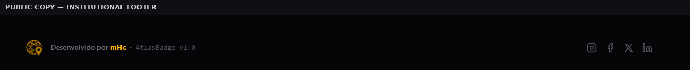

# QR-01 — Map persistence mitigation and affected-area dashboard regression

**Evidence ID:** AB-EV-008  
**Related quality risks:** QR-01, QR-18, QR-19, QR-25 and QR-39  
**Product:** AtlasBadge V1.0  
**Evidence type:** Risk mitigation assessment and affected-area regression  
**Environment:** Local development, Firebase Auth/Firestore Emulators, Microsoft Edge and Next.js production build  
**Git state covered:** AtlasBadge `main` through `83f5650`  
**Evidence date:** 2026-07-29  
**Decision owner:** Test Lead/Product Owner  
**Evidence status:** Public narrative and sanitised local screenshots complete; Production deployment and Production smoke are not independently evidenced in this package  
**Quality-risk decision:** QR-01 remains **Current gap** — the map persistence path is mitigated, while broader persistence coverage remains incomplete  

## 1. Executive summary

This record consolidates the investigation and regression work performed after QR-01 identified a silent-persistence risk in the AtlasBadge map flow.

The original map mutation path updated React state and the UID-scoped browser cache before the Firestore write was confirmed. If the write remained pending or failed and the application reloaded while the remote read was unavailable, the cache could preserve an unconfirmed state and present it as if it had been saved.

The corrected map path now separates three states:

1. **optimistic UI state**, applied immediately for responsiveness;
2. **confirmed cache state**, updated only after the Firestore write succeeds;
3. **rollback state**, restored after a rejected write.

The assessment also found and corrected affected-area regressions in visit responsiveness, cross-screen statistics, continent progress, Firebase Emulator selection, country-flag loading, registered-place filters and client/server component boundaries.

The work provides strong evidence for the map-status and visit path. It does not prove that every AtlasBadge persistence flow uses the same confirmed-cache contract. QR-01 therefore remains a Current gap rather than being moved to Mitigated.

## 2. Risk statement

> A Firestore write may fail while the interface and local cache continue to show the change as saved, causing silent data loss in a later session.

The material failure mode was:

```text
optimistic React update
→ immediate localStorage write
→ pending or rejected Firestore write
→ reload or failed remote read
→ unconfirmed cache displayed as saved data
```

Potential consequences included:

- silent loss of status or visit changes;
- incorrect counters after reload;
- false confidence that data had been persisted;
- divergence between the personal map and public profile;
- retry or queue behaviour producing duplicate or stale values.

## 3. Scope

### 3.1 Persistence scope

The persistence assessment covered the registered-place map path used for:

- travel-status updates;
- adding visits;
- removing visits;
- `visitsCount`;
- registered-place state;
- optimistic React updates;
- confirmed local cache updates;
- Firestore writes;
- rollback;
- retry;
- queued mutations;
- reload and cache fallback.

Profile and account flows were inventoried during the investigation, but this package does not claim that every non-map write path has completed equivalent failure, reload and recovery coverage.

### 3.2 Affected-area regression

The regression package also covered:

- canonical Total Visits calculation;
- parity between personal-map and public-profile statistics;
- `251` selectable places;
- `195` countries;
- `52` territories and entities;
- eight public continent-progress groups;
- registered-place search and filters;
- filter reset and selected-place reset;
- filter-count badge layout;
- country-selector flag loading;
- institutional GitHub link in the Footer;
- explicit Firebase Emulator opt-in;
- Next.js Server/Client component boundaries;
- Home, Map and Public Profile runtime recovery.

## 4. Root cause and correction

### 4.1 Cache poisoning

The mutation orchestrator previously called a single update callback for both optimistic rendering and durable browser-cache persistence.

That coupling allowed an unconfirmed state to enter `localStorage`.

The correction introduced an explicit cache-persistence decision:

| Mutation stage | React state | Confirmed cache |
|---|---|---|
| Optimistic update | Updated immediately | Not updated |
| Firestore success | Confirmed state retained | Updated |
| Firestore failure | Rolled back | Last confirmed state restored |

The Firestore document remains the source of truth for authenticated map data.

### 4.2 Queue responsiveness

The initial correction protected cache integrity but exposed a responsiveness issue for rapid sequential mutations because optimistic updates could become coupled to the queued remote promise chain.

The queue was refined so that:

- the in-memory reference is synchronised immediately;
- optimistic rendering does not wait for earlier Firestore confirmations;
- remote writes remain ordered;
- success confirms the cache;
- failure rolls back the affected state;
- retry does not duplicate visits or counters.

### 4.3 Firebase local-mode selection

Local development previously connected to Firebase Emulators based only on `NODE_ENV=development`.

Because `npm run dev` always uses development mode, normal local Google login could be redirected to an inactive Auth Emulator.

The final contract requires explicit opt-in:

```text
NEXT_PUBLIC_USE_FIREBASE_EMULATORS=true
```

An absent, false or invalid value uses the configured real Firebase environment.

## 5. Canonical statistics and cross-screen consistency

The regression identified inconsistent or duplicated calculations between My Map and Public Profile.

The approved presentation is:

| Metric | Canonical meaning |
|---|---|
| Locations visited | Physically visited selectable places out of 251 |
| Countries visited | Physically visited countries out of 195 |
| Territories and entities | Physically visited combined group out of 52 |
| Total Visits | Sum of every place `visitsCount` |
| Continents | Distinct visited display groups out of 8 |
| World explored | Locations visited divided by the 251-place catalogue |

Total Visits was centralised so that both screens derive the value from the same rule:

```text
Total Visits = sum of visitsCount for all user places
```

Detailed `registeredVisits` records may be fewer than `visitsCount` and are not used as an alternative total.

The owner view of the Public Profile also refreshes after confirmed map updates so that a client-side navigation does not preserve a stale remote snapshot.

## 6. Continent progress

The public presentation uses eight display groups:

1. South America;
2. Central America;
3. North America;
4. Antarctica;
5. Africa;
6. Asia;
7. Europe;
8. Oceania.

A continent counts as visited only when at least one place in that group has qualifying physical presence.

A catalogue group with `0/N` progress remains visible but does not increase the `X/8` numerator.

## 7. Registered-place filtering

The My Map update area now reuses the established country-filter model while restricting the dataset to places already registered by the user.

Controls include:

- existing free-text search;
- continent search, including terms such as `Europe`;
- status filters;
- applicable place-type filters;
- logical `AND` between text and selected filters;
- explicit `Clear filters`;
- selected-place reset on My Map;
- filter-only reset in the 251-place selector;
- distinct filtered-empty and no-registered-place states.

Filtering is presentational only. It does not modify Firestore, browser cache, statuses, visits or memories.

## 8. UI reliability corrections

### 8.1 Flag loading

The country selector rendered a large catalogue of flag images without loading them on demand.

The shared flag component now:

- lazy-loads images;
- displays a stable code fallback;
- replaces the fallback after successful load;
- resets image state when the place code changes;
- preserves dimensions and prevents empty rows.

### 8.2 Footer GitHub link

GitHub remains an institutional Footer link.

User-editable profile links remain limited to:

1. Instagram;
2. Facebook;
3. X;
4. LinkedIn.

No GitHub profile field was added.

### 8.3 Filter-count badge

The active-filter count was moved from a negative absolute offset into the button's normal flex flow.

The final visual structure is equivalent to:

```text
[ icon ] [ Filters ] [ active count ]
```

This avoids clipping in both My Map and the catalogue selector.

### 8.4 Next.js Server/Client boundary

A mixed barrel export allowed a hook-dependent filter panel to enter the dependency graph of a Server Component.

The recovery:

- retained the root page as a Server Component;
- used direct imports at the relevant boundary;
- marked hook-dependent components as Client Components;
- removed the problematic re-export path;
- restored runtime HTTP responses and production builds.

## 9. Traceability

| Risk or requirement | Implementation or control | Verification |
|---|---|---|
| QR-01 — unconfirmed cache shown as saved | optimistic UI separated from confirmed cache | orchestrator, context, reload, retry and Client SDK Emulator tests |
| QR-18 — totals fail to recalculate | canonical travel coverage and continent calculation | focused statistic tests and manual cross-screen validation |
| QR-19 — Total Visits diverges | shared `calculateTotalVisits` rule | focused total test and Map/Public Profile parity validation |
| QR-25 — geographic totals differ | 251 / 195 / 52 / 8 display taxonomy | tests, build and visual validation |
| QR-39 — slow or difficult UI | responsive visit queue, lazy-loaded flags and filters | focused tests and Test Lead manual validation |
| Local Google login redirected to Emulator | explicit Emulator opt-in | Firebase mode tests and local real-login validation |
| Filter reset changes data | presentation-only reset | component tests and manual validation |
| Client-only hook reaches server page | explicit Client boundary and direct imports | clean Next.js build and local runtime validation |

## 10. Automated validation

The final reported local gate set included:

| Gate | Result |
|---|---|
| Vitest | 72 passed, 0 failed |
| Focused QR-01 Client SDK Emulator validation | Passed |
| Retry and idempotency | Passed |
| Queue and rollback integrity | Passed |
| Total Visits canonical calculation | Passed |
| Continent calculation | Passed |
| Country flag component | Passed |
| Dashboard filters and reset controls | Passed |
| Next.js production build | Passed |
| `git diff --check` | Passed |
| Global ESLint | Failed — pre-existing baseline violations; no new violations reported in changed files |

The ESLint exit code remains a failed gate with an accepted baseline exception. It is not represented as Passed.

## 11. Git traceability

| Commit | Purpose |
|---|---|
| `0816e0e` | Prevent unconfirmed map state from poisoning the confirmed cache |
| `c363b04` | Require explicit Firebase Emulator opt-in |
| `234bc0a` | Keep queued map updates responsive |
| `5140641` | Align personal-map and public-profile metrics |
| `8951cf1` | Restore Footer GitHub and lazy-load flags |
| `83f5650` | Add registered-place filters and reset controls |

The reported final AtlasBadge Git state was:

- `main`;
- local HEAD and `origin/main` aligned at `83f5650`;
- ahead/behind `0/0`;
- clean working tree;
- no force push.

## 12. Sanitised public evidence

### AB-EV-008-01 — My Map metric taxonomy


The public copy removes the personal greeting and masks user-specific values while retaining the final labels and order.

### AB-EV-008-02 — Public Profile metric parity



The personal profile panel is excluded. User-specific values are masked while the six-metric layout remains visible.

### AB-EV-008-03 — Country-selector flag rendering



This general-catalogue view contains no account identity or private travel record. It demonstrates stable flag rendering inside the scrollable selector.

### AB-EV-008-04 — Institutional Footer link set



The public crop contains only the product Footer and institutional social links.

## 13. Test Lead decision

**Local scope approved; QR-01 remains Current gap.**

The Test Lead approved:

- the corrected map cache contract;
- immediate optimistic map rendering;
- rollback and retry behaviour;
- canonical visit totals;
- cross-screen metric parity;
- eight-group continent progress;
- registered-place filters and reset controls;
- country-flag loading;
- Footer GitHub restoration;
- local runtime and production-build recovery.

The risk is not moved to Mitigated because this record does not prove equivalent failure, reload and recovery coverage for every persistence flow in the product.

## 14. Production status and limitation

The AtlasBadge commits were reported as pushed to `main`.

This public package does **not** independently prove:

- a Vercel deployment with status `Ready` for `83f5650`;
- a completed Production smoke for the final six-commit package;
- Production mutation testing;
- broader non-map persistence coverage.

A future Production smoke record may reference AB-EV-008 without changing its scoped QR-01 conclusion.

## 15. Residual risk and regression expectation

Permanent coverage should retain:

- pending, successful and rejected map writes;
- cache state before and after confirmation;
- reload with remote-read failure;
- retry and idempotency;
- sequential mutations;
- Total Visits parity;
- Map/Public Profile parity;
- 251 / 195 / 52 / 8 taxonomy;
- flag loading in long scrollable lists;
- registered-place filter restriction;
- filter reset;
- Firebase real/Emulator mode selection;
- Next.js Server/Client import boundaries.

## 16. Publication control

The screenshots were cropped and sanitised.

The public package excludes:

- real e-mail addresses;
- usernames;
- profile names;
- personal photographs;
- personal travel counts;
- notes or memories;
- UIDs;
- tokens;
- cookies;
- OAuth URLs;
- `.env` values;
- private payloads;
- raw AI-assisted investigation logs.

Raw screenshots and operational logs remain private.
